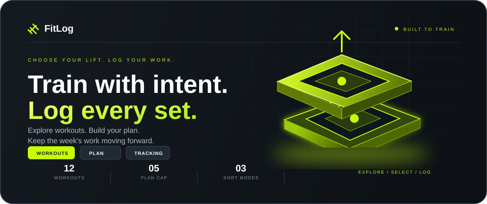
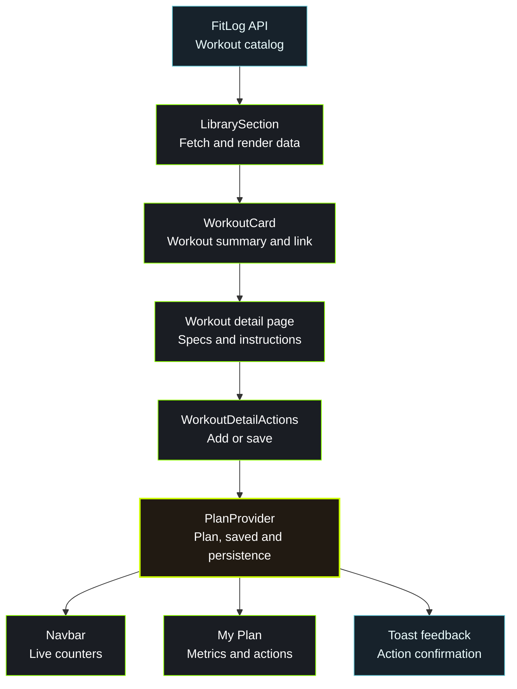

<a id="top"></a>

<div align="center">



<br />

<p>
	<a href="#getting-started"></a>
	&nbsp;
	<a href="#about-the-project"></a>
	&nbsp;
	<a href="#the-experience"></a>
	&nbsp;
	<a href="#tech-stack"></a>
	&nbsp;
	<a href="#react-questions"></a>
</p>

<h2>Great training starts with the right plan.</h2>

<p>Browse focused workouts. Build your plan. Keep every session moving.</p>

<p><sub><strong>CURATED WORKOUTS</strong> &nbsp; · &nbsp; <strong>LIVE PLAN TRACKING</strong> &nbsp; · &nbsp; <strong>INSTANT FEEDBACK</strong></sub></p>

</div>

<br />

## About the Project

**FitLog brings a practical workout library and a daily training plan into one place.**

Browse a live catalog of twelve lifts, open a dedicated detail page for any workout and
review its equipment, difficulty, sets, reps, duration, calories, rating and instructions.
Add workouts to today's plan, save lifts for later and track the session from the My Plan
dashboard.

Built with Next.js and React, this project focuses on a complete workout flow: loading
remote data, sorting the library, preventing duplicates, enforcing a five-workout plan cap,
persisting choices across reloads and giving immediate feedback after every action.

## The Experience

<table>
<tr>
<td width="33%" valign="top">
<sub>01 / EXPLORE</sub>
<h3>Find your next lift.</h3>
<p>Browse workout cards with muscle groups, equipment, duration, calories and rating. Sort the library by the metric that matters today.</p>
</td>
<td width="34%" valign="top">
<sub>02 / BUILD</sub>
<h3>Compose today's plan.</h3>
<p>Add workouts to a focused five-lift plan or save them for later. Navbar counters update as the plan changes.</p>
</td>
<td width="33%" valign="top">
<sub>03 / LOG</sub>
<h3>Finish and move forward.</h3>
<p>Mark a workout as done, review live session metrics and keep your saved list ready for the next training day.</p>
</td>
</tr>
</table>

### Small details that matter

| Detail | What you see |
| :--- | :--- |
| Live workout data | The library and detail pages load workout information from the FitLog API. |
| Sorting | Duration, calories and rating options reorder the workout library instantly. |
| Duplicate protection | A workout cannot be added twice to the plan or saved list. |
| Plan cap | Today's plan stops at five lifts and explains why another cannot be added. |
| Empty state | A clear prompt sends an empty plan back to the workout library. |
| Loading state | A loading message appears while the plan data is restored. |
| Responsive layout | Cards, navigation, controls and detail pages adapt to mobile, tablet and desktop screens. |
| Mobile navigation | A collapsible menu keeps the primary routes available on smaller screens. |

> **Session behavior:** Today's plan and saved workouts persist in `localStorage` and return after a page reload.

<br />

## Tech Stack

<div align="center">


</div>

<br />

| Technology | Responsibility |
| :--- | :--- |
| Next.js 16 | App Router, server-rendered detail pages and production builds |
| React 19 | Component composition, client state and interactive controls |
| TypeScript | Typed workout data, props and application contracts |
| Tailwind CSS 4 | Responsive layout, spacing, typography and visual styling |
| lucide-react | Interface icons for navigation, stats and actions |
| react-hot-toast | Immediate feedback for add, save, remove and log actions |
| FitLog API | Remote workout catalog and individual workout details |
| localStorage | Persistence for today's plan and saved workouts |

<details>
<summary><strong>Explore the application routes</strong></summary>

<br />

| Route | Purpose |
| :--- | :--- |
| `/` | Workout library and sorting controls |
| `/workout/[id]` | Workout image, specs, instructions and plan actions |
| `/my-plan` | Today's Plan, Saved workouts and session metrics |
| `/_not-found` | Branded fallback for unknown routes and invalid workout ids |

</details>

<br />

## Under the Hood

`LibrarySection` loads the workout catalog and passes the result into the library view.
`PlanProvider` owns the active plan, saved list, persistence and action feedback, keeping
the navbar, workout cards, detail actions and My Plan dashboard connected to the same state.



**How actions update the shared state**

| From | Callback | Parent action |
| :--- | :--- | :--- |
| `WorkoutCard` | Link to `/workout/[id]` | Open the full workout detail page. |
| `WorkoutDetailActions` | `addToPlan(workout)` | Validate the cap and add the workout to today's plan. |
| `WorkoutDetailActions` | `addToSaved(workout)` | Prevent duplicates and add the workout to saved items. |
| `PlanWorkoutCard` | `onMarkDone()` | Remove the finished workout and show a success toast. |
| `PlanWorkoutCard` | `onRemove()` | Remove a workout from the active plan or saved list. |

<details>
<summary><strong>Project structure</strong></summary>

```text
app/
	page.tsx                 # Workout library home
	LibrarySection.tsx       # Data loading boundary
	my-plan/page.tsx         # Plan dashboard
	workout/[id]/page.tsx    # Workout detail page
	globals.css              # Global theme styles
components/
	Hero.tsx
	Library.tsx
	WorkoutCard.tsx
	PlanWorkoutCard.tsx
	WorkoutDetailActions.tsx
	Navbar.tsx
	Footer.tsx
context/
	PlanContext.tsx          # Shared plan and saved state
lib/
	api.ts                   # FitLog API requests
	sort.ts                  # Workout sorting logic
types/
	workout.ts               # Workout data contract
public/
	banner.png
	logo.png
```

</details>

<br />

## Getting Started

From the project folder, with Node.js and npm installed:

```bash
npm install
npm run dev
```

Open the local URL shown in the terminal, usually `http://localhost:3000`.

| Task | Command |
| :--- | :--- |
| Start development | `npm run dev` |
| Build for production | `npm run build` |
| Start the production server | `npm run start` |
| Run ESLint | `npm run lint` |

<br />

## React Questions

Seven concepts behind the interface, with examples from this project.

### 1. What is JSX, and why is it used in React?

JSX is a syntax extension that lets a component describe its UI with markup-like syntax
inside JavaScript or TypeScript. It keeps the structure of a workout card close to the
data and event handlers that control it. FitLog uses JSX throughout its pages and components.

### 2. What is the difference between props and state?

Props are values passed from a parent to a child and should be treated as read-only by the
child. State is data owned by a component or provider that can change and trigger a new
render. In FitLog, `Library` receives workouts through props, while `PlanProvider` owns the
plan and saved state.

### 3. What does the `useState` hook do, and where did you use it in this project?

`useState` stores a value between renders and returns a function for updating it. `Library`
uses it for the selected sort option, `Navbar` uses it for the mobile menu, and `PlanProvider`
uses it for the plan, saved workouts and loading state.

```tsx
const [sortBy, setSortBy] = useState<SortOption>("Duration");
```

### 4. What does the `useEffect` hook do, and why did you need it for persistence?

`useEffect` runs side effects after React renders. `PlanProvider` uses it to restore the plan
and saved list from `localStorage`, then uses separate effects to write updates back after
the state changes. `Navbar` and `SortDropdown` also use client-side state effects for their
interactive behavior.

### 5. Why does every item in a `.map()` list need a unique `key` prop?

A stable key helps React identify the same item between renders, even when items are added,
removed or reordered. FitLog uses workout ids for workout cards and plan cards, and labels for
the repeated specification rows and muscle-group tags.

### 6. What is conditional rendering? Show one place you used it.

Conditional rendering chooses which UI to display based on a condition. On the My Plan page,
FitLog shows a loading message while storage is being restored, an `EmptyPlanState` when the
selected list is empty, or the matching `PlanWorkoutCard` items when workouts are available.

### 7. How do you pass data from a parent component to a child component, and how does a child send something back?

A parent passes data and callback functions through props. A child calls the callback when an
interaction happens, allowing the parent or shared provider to update state.

```tsx
<WorkoutCard key={workout.id} workout={workout} />
<PlanWorkoutCard
	workout={workout}
	onRemove={() => removeFromPlan(workout.id)}
/>
```

Here, the parent supplies workout data and an action callback. The child invokes the callback
from a button, and the provider updates the shared plan.

<br />

| No. | Concept | In this project |
| :--- | :--- | :--- |
| 01 | JSX | Describing pages, cards and panels |
| 02 | Props and state | Sharing workout data and plan state |
| 03 | `useState` | Storing sort, menu and plan state |
| 04 | `useEffect` | Restoring and persisting local data |
| 05 | List keys | Identifying workouts and repeated rows |
| 06 | Conditional rendering | Showing loading, empty and populated states |
| 07 | Component communication | Connecting cards and provider actions |

<br />

## Submission

| Resource | Link |
| :--- | :--- |
| GitHub Repository Link | [SamaunRezvi/assignment_six](https://github.com/SamaunRezvi/assignment_six) |
| Live Site Link | [FitLog Workout Library](https://assignment-six-one-gamma.vercel.app/) |

<br />

<div align="center">

<p><strong>FITLOG</strong></p>
<p><sub>TRAIN HARD · LOG HONEST</sub></p>

<a href="https://github.com/SamaunRezvi/assignment_six">Explore the repository ↗</a> &nbsp; · &nbsp; <a href="#top">Back to top ↑</a>

</div>
